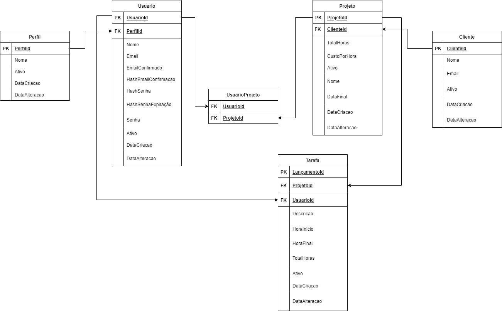

#  Horas Raras

Uma API desenvolvida em .NET CORE 6 que fornece ferramentas para que seja feito o rastremento de horas de cada tarefa realizada por um colaborador em um projeto cadastrado.

## :mag: Índice

**1. [Sobre a Ferramenta](#computer-sobre-a-ferramenta)**

1. [Funcionalidades](#funcionalidades)
2. [Regras de acesso](#regras-de-acesso)

**2. [Modelo Lógico](#mag-modelo-lógico)**

**3. [Como rodar a aplicação](#game_die-como-rodar-a-aplicação)**

**4. [Rotas](#oncoming_automobile-rotas)**

1. [Rota Conta](#rota-conta)
2. [Rota Projeto](#rota-projeto)
3. [Rota Tarefa](#rota-tarefa)
4. [Rota Cliente](#rota-cliente)
5. [Rota Integração](#rota-integração-toggl)

**4. [Banco de dados](#floppy_disk-banco-de-dados)**

**4. [Testes](#white_check_mark-testes-unitários)**

**5. [Informações Git Flow](#ocean-informações-git-flow)**

**6. [Colaboradores](#rocket-colaboradores)**

## :computer: Sobre a Ferramenta

### Funcionalidades

- **Usuarios**

  - Colaboradores: Cadastro, confirmação de email e Equesci minha senha;

  - Admin: Cadastro com poderes de admin,criar projetos e realizar o vínculo de colaboradores com o projeto;

- **Lançamento de Horas**

  - Lançamento de horas com o ínico e fim da tarefa, projeto ao qual aquela tarefa deverá ser atribuída e descrição da tarefa;

  - O sistema permite a edição do lançamento de horas e até mesmo do projeto ao qual aquela tarefa foi atribuída. O limite de tempo para alteração é de 48h;

  - O histórico de edições do sistema é salvo em uma tabela de log no banco de dados;

  - As informações de lançamento de tarefas poderão ser acessadas por filtros de esta semana, este mês e mês passado;

  - As informações de lançamento poderão ser acessadas por filtros de projeto;

### Regras de acesso

- **Administrador**

  - Permissão para criar projetos e vincular colaboradores a eles;

  - Informações cadastradas pelos colaboradores poderão ser visiveis, editadas e excluíveis pelo admin;

  - Acesso ao relatório de tarefas por colaborador e por projeto

- **Colaborador**

  - Lançar horas;

  - Ver, editar e excluir horas lançadas por ele;

## :mag: Modelo Lógico

- Relacionamento Usuario : Projeto

  > Um usuário(Colaborador) pode pertencer a vários projetos e um projeto pode ter vários usuários

- Relacionamento Projeto : Cliente

  > Um projeto pertence a um cliente, mas um cliente pode ter vários projetos

- Relacionamento Lançamento de Horas : Projeto

  > Um lançamento de horas pertence a um projeto, mas um projeto pode ter vários lançamentos

<br>
<br>


## :game_die: Como rodar a aplicação

```bash
# Clone este repositório
$ git clone https://gitlab.com/Lili200Cardoso/horas_raras.git

# Acesse a pasta do projeto no terminal/cmd
$ cd horas_raras

# Vá para a pasta da API
$ cd HorasRaras.Api


# Execute a aplicação em modo de desenvolvimento
$ dotnet run

# O servidor inciará na porta:7233 - acesse http://localhost:7233/swagger
```

- Para utilizar a aplicação com permissões de admin é necessário fazer o login com as informações abaixo

```json
{
  "senha": "1234Horas*",
  "email": "horas.raro@gmail.com"
}
```

## :oncoming_automobile: Rotas

### Rota Conta

Endpoint para manipular ou mostrar informações relacionada à conta

- [Criar conta](rotas/contas/post.md) : `POST /conta/cadastro/`
- [Confirmar email](rotas/contas/patch.md) : `PATCH /conta/email/:hash/`

- [Autenticar(login)](rotas/contas/login.md) : `POST /conta/login/`
- [Enviar hash para alterar senha](rotas/contas/hashSenha.md) : `PUT /conta/hash-senha/`
- [Alterar senha](rotas/contas/senha.md) : `PUT /conta/senha/:hash/`

### Rota Projeto

- [Criar Projeto](rotas/projeto/post.md) : `POST /projeto/`
- [Obter Projetos](rotas/projeto/get.md) : `GET /projeto/`

- [Obter Projeto](rotas/projeto/getid.md) : `GET /projeto/:id/`
- [Obter Horas](rotas/projeto/getHora.md) : `GET /projeto/hora/:id/`
- [Vincular Usuario](rotas/projeto/patch.md) : `PATCH /projeto/usuario/`
- [Deletar Projeto](rotas/projeto/delete.md) : `DELETE /projeto/:id/`
- [Alterar projeto](rotas/projeto/put.md) : `PUT /conta/senha/:id/`

### Rota Tarefa

- [Criar Tarefa](rotas/tarefa/post.md) : `POST /tarefa/`
- [Obter Tarefas](rotas/tarefa/get.md) : `GET /tarefa/`

- [Obter Tarefas semana](rotas/tarefa/get.md) : `GET /tarefa/semana/`
- [Obter Tarefas mês](rotas/tarefa/get.md) : `GET /tarefa/mes/`
- [Obter Tarefas dia](rotas/tarefa/get.md) : `GET /tarefa/dia/`
- [Obter Tarefas Projeto](rotas/tarefa/get.md) : `GET /tarefa/projeto/:id/`
- [Obter Tarefa](rotas/tarefa/getid.md) : `GET /tarefa/:id/`
- [Atualiza HoraFinal](rotas/tarefa/patch.md) : `PATCH /tarefa/hora-final/:id/`
- [Deletar Tarefa](rotas/tarefa/delete.md) : `DELETE /tarefa/:id/`
- [Alterar Tarefa](rotas/tarefa/put.md) : `PUT /conta/senha/:id/`

### Rota Usuário

- [Obter Usuários](rotas/usuario/get.md) : `GET /projeto/`
- [Criar Admin](rotas/cusuario/post.md) : `POST /conta/cadastro/`

- [Obter Usuario](rotas/usuario/getid.md) : `GET /projeto/:id/`

- [Deletar Usuario](rotas/usuario/delete.md) : `DELETE /projeto/:id/`
- [Alterar usuario](rotas/usuario/put.md) : `PUT /conta/senha/:id/`

### Rota Cliente

- [Criar Cliente](rotas/cliente/post.md) : `POST /tarefa/`
- [Obter Clientes](rotas/cliente/get.md) : `GET /projeto/`

- [Obter Cliente](rotas/cliente/getid.md) : `GET /projeto/:id/`
- [Deletar Cliente](rotas/cliente/delete.md) : `DELETE /projeto/:id/`
- [Alterar Cliente](rotas/cliente/put.md) : `PUT /conta/senha/:id/`

### Rota Integração Toggl

- [Integrar dados do Toggl](rotas/toggl/post.md) : `POST /toggl/integracao`

## :floppy_disk: Banco de dados

Foi utilizado um banco de dados relacional para armazenar as informações do sistema e o Sql Server como SGBD(Sistema de gerenciamento de banco de dados);

Como ORM(Mapeamento objeto relacional) foi utilizado o Entity Framework, pois fornece suporte a consultas LINQ, controle de alterações, atualizações e migrações de esquema.

## :white_check_mark: Testes Unitários

O sistema conta com uma ampla cobertura de testes unitáiros. A ferramenta utilizada para os testes é o xUnit, gratuita e de código aberto para o .Net Core

- **Coverege**
  - Line Coverage **81.4%**
  - Branch Coverage **64.7%**

## :ocean: Informações Git flow

- [Issues](https://gitlab.com/Lili200Cardoso/horas_raras/-/boards) : `Issues do Projeto GitLab`
- [PRs](https://gitlab.com/Lili200Cardoso/horas_raras/-/merge_requests?scope=all&state=merged) : `PRs do Projeto GitLab`

## :rocket: Colaboradores

<table>
  <tr>
    <td align="center"><a href="https://gitlab.com/Phses"><br /><sub><b>Pedro Henrique</b></sub></a><br /><a href="https://rocketseat.com.br/" title="Rocketseat">👨‍🚀</a></td>
    <td align="center"><a href="https://gitlab.com/Lili200Cardoso"><br /><sub><b>Lili</b></sub></a><br /><a href="https://rocketseat.com.br/" title="Rocketseat">👨‍🚀</a></td>
    <td align="center"><a href="https://gitlab.com/LuigiCastro_"><br /><sub><b>Luigi</b></sub></a><br /><a href="https://rocketseat.com.br/" title="Rocketseat">👨‍🚀</a></td>
  </tr>
</table>
