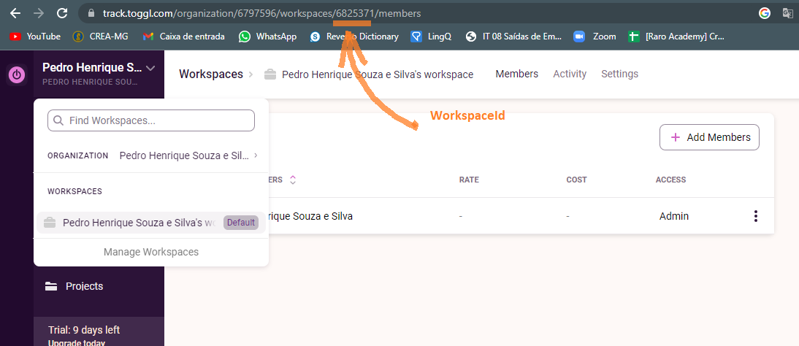
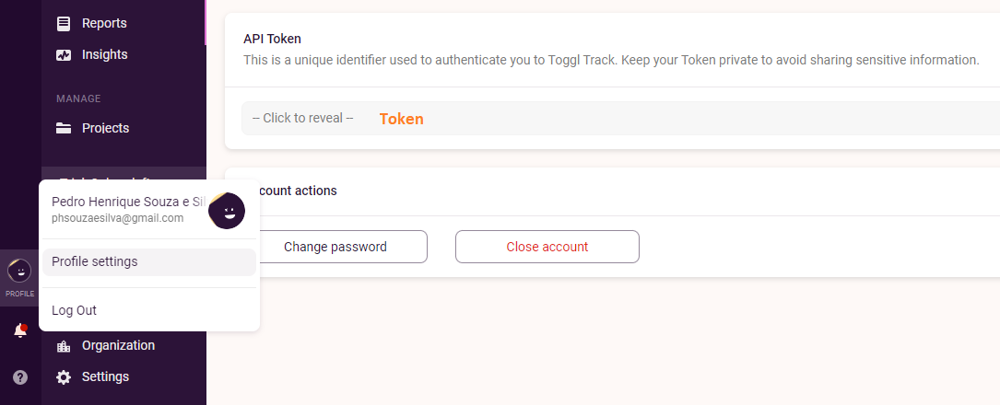

# Integração Toggl

Pensando em facilitar o processo de transição do Toggle para o sistema Horas Raras, foi disponiblizado uma rota para que seja feita a migração dos dados existentes no Toggle para o banco de dados Horas Raras.

Para a integração foi utilizada a API pública Toggl Reports V2

- [API Toggl](https://github.com/toggl/toggl_api_docs/blob/master/reports.md)

**URL** : `/toggl/integracao/`

**Method** : `POST`

**Auth requerida** : SIM

**Permissão requerida** : Colaborador

**Dados requisição**

```json
{
  "workspaceId": "string",
  "since": "string",
  "until": "string",
  "userAgent": "string",
  "token": "string"
}
```

**Dados para integração com o toggle com valores que populamos**

- Projetos que precisam estar cadastrados
  - Academy.DDD
  - Acdemy_TDD
  - Horas_Raras

```json
{
  "workspaceId": "6838490",
  "since": "2022-11-17",
  "until": "2022-11-28",
  "userAgent": "api_test",
  "token": "e1dba3fb617797bd671a6f34fe09191a"
}
```

- Projetos que precisam estar cadastrados
  - Academy_HorasRaro
  - Raro_ProjetoFinal
  - TrabalhoFinal_RaroAcademy

```json
{
  "workspaceId": "6797596",
  "since": "2022-11-17",
  "until": "2022-11-28",
  "userAgent": "api_test",
  "token": "68bb16e17a5ec16c621e290230fb056f"
}
```

**Exemplo**

> O campo workspaceId da requisição é acessado na pagina do usuário no toggl clicando no seu nome do lado superior esquerdo da tela e acessando Manege Workspaces. O número que aparece na url do navegador após workspaces é o workspaceId. Como mostrado na figura abaixo.

# 

> O campo token da requisição é acessado clicando em profile no Toggle, e logo após clicando em profile settings. Como mostrado na figura abaixo.

# 

- **userAgent** é definido pela documentação da API do toggle como **api_test**

- **Since** é a data das tarefas de onde você deseja começar a migração dos dados;

- **Until** é o limite da data das tarefas que você deseja migrar;

```json
{
  "workspaceId": "6825371",
  "since": "2013-05-20",
  "until": "2020-05-20",
  "userAgent": "api_test",
  "token": "70cb16f17a5ec16c621e295450gb056f"
}
```

## Resposta Sucesso

**Condição** :

- O projeto do toggle precisa ter o mesmo nome do projeto cadastrado no sistema Horas Raras;

- O usuário da requisição precisa estar vinculado ao projeto em que a tarefa está sendo cadastrada;

- As tarefas serão vinculadas ao usuario que está fazendo a requisição;

- Um adiministrador não pode fazer a integração dos dados, precisa ser um colaborador;

**Código** : `201 CREATED`

## Resposta erro

**Conteúdo**

```json
{
  "codigo": "Nenhum",
  "descricao": "string",
  "mensagens": ["string"],
  "detalhe": "string"
}
```

**Condição** : Se os parâmetros passados não forem condizentes com uma conta ativa no toggl.

**Código** : `400 BAD REQUEST`

### Notas

- Tarefas em que os atributos exigidos para a realização do cadastro no sistema horas raras não existirem, serão ignoradas.
- Tarefas que estejam vinculadas a projetos quenão existam no sistema horas raras não serãocadastradase o usuario será notificado por email.
- Tarefas que estão sendo migradas, mas o usuário responsável por ela não está vinculado ao projeto referenta àquela tarefa, não serão cadastras no sitema e o usuário será notificado por email.
